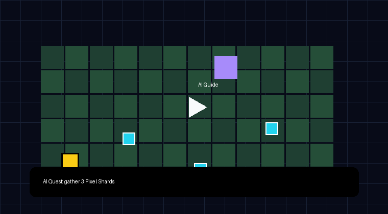

<p align="center">
  
</p>

<h1 align="center">Open Pixel</h1>

<p align="center">
  <strong>AI-native Web3 pixel quest game — no token economy, no real RMT, guest-first by default.</strong>
</p>

<p align="center">
  <a href="#quick-start">Quick start</a> ·
  <a href="#how-it-works">How it works</a> ·
  <a href="#repository-layout">Repository layout</a> ·
  <a href="docs/SECURITY_MODEL.md">Security model</a> ·
  <a href="docs/VISUAL_STYLE.md">Visual style</a> ·
  <a href="docs/ROADMAP.md">Roadmap</a>
</p>

---

## What is Open Pixel?

Open Pixel is a cozy browser RPG prototype inspired by social pixel worlds like Pixels.xyz. Players enter as guests, explore a farm village, gather resources, fulfill orders, earn off-chain points, and optionally create a safe wallet proof.

The project is intentionally **not** a token economy. There is no staking, no swaps, no NFT marketplace, and no play-to-earn financial loop. The Web3 layer is limited to an optional readable wallet signature that proves quest completion.

## Demo

> Demo GIF/video slot. Add the final gameplay capture before submission.

<p align="center">
  <a href="https://example.com/open-pixel-demo.mp4">
    
  </a>
</p>

## Core value

- Browser-based cozy resource-village loop.
- Guest-first onboarding: no wallet required to play.
- Deterministic resource-village loop: fast, no external API cost.
- Optional wallet proof via readable `personal_sign` message only.
- Supabase-backed leaderboard/proof storage using the free tier.
- Monorepo layout for game, web claim page, and shared proof helpers.

## How it works

```text
Guest player
  → enters RPG-JS farm village
  → plants, waters, harvests crops
  → chops trees, mines rocks
  → fulfills village orders
  → earns off-chain points
  → claims guest badge
  → optionally signs readable wallet proof
  → appears on leaderboard
```

### What the wallet proof does

The wallet proof is deliberately narrow:

- No transaction.
- No gas.
- No contract call.
- No token approval.
- No NFT approval.
- No swap.
- No permit.
- No `setApprovalForAll`.
- Only a readable `personal_sign` message.

Example message:

```text
Open Pixel Proof

I completed the Cozy Resource-Village Loop with off-chain village points.

Domain: openpixel.app
Wallet: 0x...
Quest Run: run_...
Nonce: ...
Issued At: ...
Expiration Time: ...

This signature only proves quest completion.
It does not approve tokens, NFTs, swaps, transfers, or transactions.
```

## Quick start

```bash
npm install
npm run build
```

Run the game:

```bash
npm run dev:game
```

Run the web app:

```bash
cp .env.example .env
npm run dev:web
```

Supabase setup:

```bash
# In Supabase SQL editor
# paste and run supabase/schema.sql
```

Then set:

```bash
VITE_SUPABASE_URL=https://your-project.supabase.co
VITE_SUPABASE_ANON_KEY=your-supabase-anon-key
VITE_GAME_URL=/game
```

> Never expose a Supabase `service_role` key in the browser. This repo only expects the anon key on the frontend.

## Repository layout

```text
open-pixel/
  apps/
    game/       # RPG-JS game: map, village, resource loop
    web/        # React/Vite claim page, wallet proof, leaderboard shell
  packages/
    shared/     # proof message helpers + shared types
  supabase/     # schema and RLS policies
  docs/         # design, security, roadmap, contributor docs
  assets/       # README/logo/demo media
```

## Tech stack

- **RPG-JS** — game world, map, events, NPC dialog, player variables.
- **React + Vite** — landing, claim page, wallet proof UX.
- **Supabase** — free-tier persistence for players, quest runs, proofs, leaderboard.
- **Browser wallet provider API** — optional `personal_sign` proof flow; no tx library required.
- **Husky + lint-staged + Prettier** — basic repo hygiene.

## Design choices

Open Pixel is scoped as a contest demo first:

- Fun quest loop before financial mechanics.
- Off-chain points before tokens.
- Guest account before wallet.
- Wallet proof before on-chain transactions.
- Readable signatures before opaque typed-data signing.

See [`docs/DESIGN.md`](docs/DESIGN.md) for the full plan.

## Documentation & community

- Docs: [`docs/`](docs/)
- Security model: [`docs/SECURITY_MODEL.md`](docs/SECURITY_MODEL.md)
- Contributing: [`CONTRIBUTING.md`](CONTRIBUTING.md)
- Security policy: [`SECURITY.md`](SECURITY.md)
- Discord: coming soon
- Hackathon page: coming soon

## License

MIT. See [`LICENSE`](LICENSE).
