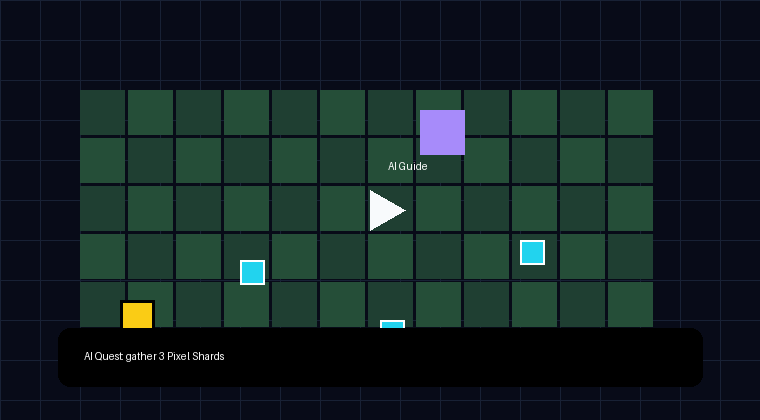

<p align="center">
  
</p>

<h1 align="center">Open Pixel</h1>

<p align="center">
  <strong>Guest-first cozy pixel RPG in the browser — no token economy, with an optional read-only wallet proof.</strong>
</p>

<p align="center">
  <strong>Live demo:</strong> <a href="https://open-pixel-beta.vercel.app">https://open-pixel-beta.vercel.app</a>
</p>



<p align="center">
  <a href="#getting-started">Getting started</a> ·
  <a href="#how-it-works">How it works</a> ·
  <a href="#repository-layout">Repository layout</a> ·
  <a href="docs/SECURITY_MODEL.md">Security model</a> ·
  <a href="docs/VISUAL_STYLE.md">Visual style</a> ·
  <a href="docs/ROADMAP.md">Roadmap</a>
</p>

---

## What Is Open Pixel?

<<<<<<< HEAD
Open Pixel is a cozy browser RPG prototype inspired by social pixel worlds like Pixels.xyz. Players enter as guests, explore a farm village, gather resources, fulfill orders, earn off-chain points, and optionally create a safe wallet proof.
=======
Open Pixel is a cozy browser RPG inspired by social pixel worlds like Pixels.xyz. Players enter as guests, perform resource-village actions, fulfill a small board/workstation request, earn off-chain progress, and can optionally create a safe wallet proof.
>>>>>>> origin/main

The project is intentionally **not** a token economy. There is no staking, no swaps, no NFT marketplace, and no play-to-earn financial loop. The Web3 layer is limited to an optional readable wallet signature that proves completion.

## Features

<<<<<<< HEAD
> Demo GIF/video slot. Add the final gameplay capture before submission.

<p align="center">
  <a href="https://example.com/open-pixel-demo.mp4">
    
  </a>
</p>

## Core value

- Browser-based cozy resource-village loop.
- Guest-first onboarding: no wallet required to play.
- Deterministic resource-village loop: fast, no external API cost.
- Optional wallet proof via readable `personal_sign` message only.
- Supabase-backed leaderboard/proof storage using the free tier.
- Monorepo layout for game, web claim page, and shared proof helpers.

## How it works

```text
Guest player
  → enters RPG-JS farm village
  → plants, waters, harvests crops
  → chops trees, mines rocks
  → fulfills village orders
  → earns off-chain points
  → claims guest badge
  → optionally signs readable wallet proof
  → appears on leaderboard
=======
- Browser-based pixel RPG with a resource-village gameplay loop: farm, chop, mine, craft, or prepare goods.
- Guest-first onboarding — fully playable without a wallet or account.
- Village orders: fulfill a board/workstation request to earn a Game Completion Receipt and Guest Badge.
- Optional wallet proof using a human-readable `personal_sign` message — no transactions, no gas.
- Live leaderboard backed by Supabase.
- Off-chain progress tracking with no token or real-money mechanics.

```text
Guest player
-> enters RPG-JS game
-> performs resource actions
-> fulfills village order
-> receives Game Completion Receipt
-> claims Guest Badge
-> optionally signs readable Wallet Proof
-> appears on leaderboard
>>>>>>> origin/main
```

### Wallet Proof

Wallet proof is deliberately narrow:

- Only a readable `personal_sign` message — no transaction, gas, or contract call.
- Never requests token/NFT approvals, permits, swaps, or `setApprovalForAll`.
- The signature proves quest completion and nothing else.

Example message:

```text
Open Pixel Proof

I completed the Cozy Resource-Village Loop with off-chain village points.

Domain: openpixel.app
Wallet: 0x...
Quest Run: run_...
Nonce: ...
Issued At: ...
Expiration Time: ...

This signature only proves quest completion.
It does not approve tokens, NFTs, swaps, transfers, or transactions.
```

## Tech Stack

- **RPG-JS** — game world, map, resource events, player variables.
- **React + Vite** — landing page, claim page, wallet proof UX.
- **Supabase** — persistence for players, quest runs, proofs, and the leaderboard.
- **Browser wallet provider API** — optional `personal_sign` proof flow; no transaction library required.
- **TypeScript** across all workspaces; Husky + lint-staged + Prettier for repo hygiene.

## Getting Started

Prerequisites: Node.js >= 22.

```bash
npm install
npm run build
```

Run the game:

```bash
npm run dev:game
```

Run the web app:

```bash
cp .env.example .env
npm run dev:web
```

Supabase setup:

```bash
# In Supabase SQL editor, paste and run supabase/schema.sql
```

Then set the following in `.env`:

```bash
VITE_SUPABASE_URL=https://your-project.supabase.co
VITE_SUPABASE_PUBLISHABLE_KEY=your-supabase-publishable-or-anon-key
VITE_GAME_URL=/game
```

> Never expose a Supabase `service_role` key in the browser. This repo only expects an anon/publishable key on the frontend.

## Repository Layout

```text
open-pixel/
<<<<<<< HEAD
  apps/
    game/       # RPG-JS game: map, village, resource loop
    web/        # React/Vite claim page, wallet proof, leaderboard shell
  packages/
    shared/     # proof message helpers + shared types
  supabase/     # schema and RLS policies
  docs/         # design, security, roadmap, contributor docs
  assets/       # README/logo/demo media
=======
apps/
  game/      # RPG-JS game: map, resource actions, completion loop
  web/       # React/Vite claim page, wallet proof, leaderboard
packages/
  shared/    # proof message helpers + shared types
supabase/    # schema and RLS policies
scripts/     # build checks and QA harness
docs/        # design, security, roadmap, contributor docs
assets/      # logo and README media
>>>>>>> origin/main
```

## Design Choices

- Fun resource-village loop before financial mechanics.
- Off-chain progress before tokens.
- Guest account before wallet.
- Wallet proof before on-chain transactions.
- Readable signatures before opaque typed-data signing.

See [`docs/DESIGN.md`](docs/DESIGN.md) for the current product direction.

## Documentation

- Docs: [`docs/`](docs/)
- Security model: [`docs/SECURITY_MODEL.md`](docs/SECURITY_MODEL.md)
- Contributing: [`CONTRIBUTING.md`](CONTRIBUTING.md)
- Security policy: [`SECURITY.md`](SECURITY.md)

## License

MIT. See [`LICENSE`](LICENSE).
